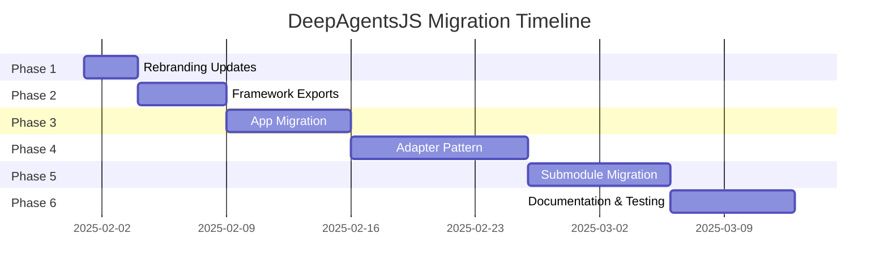

# DeepAgentsJS Modular Architecture Plan

## Executive Summary

This document provides a comprehensive modular architecture plan for DeepAgentsJS monorepo to address critical rebranding issues, decouple the application from direct LangChain dependencies, and establish a clean separation between framework and application concerns.

## Table of Contents

1. [Repository Rebranding Strategy](#1-repository-rebranding-strategy)
2. [Decoupling Strategy for App](#2-decoupling-strategy-for-app)
3. [Adapter Pattern for LangChain](#3-adapter-pattern-for-langchain)
4. [Submodule Migration Plan](#4-submodule-migration-plan)
5. [Peer Dependencies Strategy](#5-peer-dependencies-strategy)
6. [Model Provider Abstraction](#6-model-provider-abstraction)
7. [Documentation Updates](#7-documentation-updates)
8. [Testing Strategy](#8-testing-strategy)
9. [Migration Timeline](#9-migration-timeline)
10. [Future-Proofing](#10-future-proofing)

---

## 1. Repository Rebranding Strategy

### 1.1 Overview

All package.json files currently reference `langchain-ai/deepagentsjs` which causes PR submissions to LangChain's repository. This needs to be corrected to point to `DavinciDreams/deepagentsjs`.

### 1.2 Files Requiring Updates

| File | Current URL | Target URL | Priority |
|------|-------------|------------|----------|
| `package.json` (root) | `git+https://github.com/langchain-ai/deepagentsjs.git` | `git+https://github.com/DavinciDreams/deepagentsjs.git` | CRITICAL |
| `libs/deepagents/package.json` | `git+https://github.com/langchain-ai/deepagentsjs.git` | `git+https://github.com/DavinciDreams/deepagentsjs.git` | CRITICAL |
| `libs/cli/package.json` | `git+https://github.com/langchain-ai/deepagentsjs.git` | `git+https://github.com/DavinciDreams/deepagentsjs.git` | CRITICAL |
| `libs/deepagents/README.md` | `https://github.com/langchain-ai/deepagentsjs` | `https://github.com/DavinciDreams/deepagentsjs` | HIGH |
| `libs/cli/README.md` | `https://github.com/langchain-ai/deepagentsjs` | `https://github.com/DavinciDreams/deepagentsjs` | HIGH |

### 1.3 Additional Metadata Updates

The following fields also need updating across package.json files:

#### Root `package.json`
```json
{
  "name": "deepagentsjs-monorepo",
  "description": "Deep Agents - a library for building controllable AI agents with LangGraph",
  "author": "DavinciDreams",
  "bugs": {
    "url": "https://github.com/DavinciDreams/deepagentsjs/issues"
  },
  "homepage": "https://github.com/DavinciDreams/deepagentsjs#readme"
}
```

#### `libs/deepagents/package.json`
```json
{
  "name": "deepagents",
  "description": "Deep Agents - a library for building controllable AI agents with LangGraph",
  "author": "DavinciDreams",
  "bugs": {
    "url": "https://github.com/DavinciDreams/deepagentsjs/issues"
  },
  "homepage": "https://github.com/DavinciDreams/deepagentsjs#readme"
}
```

#### `libs/cli/package.json`
```json
{
  "name": "deepagents-cli",
  "description": "DeepAgents CLI - AI Coding Assistant for your terminal",
  "author": "DavinciDreams",
  "bugs": {
    "url": "https://github.com/DavinciDreams/deepagentsjs/issues"
  },
  "homepage": "https://github.com/DavinciDreams/deepagentsjs/tree/main/libs/cli#readme"
}
```

### 1.4 Verification Steps

1. **Search for remaining references**:
   ```bash
   # Search for langchain-ai references in package.json files
   find . -name "package.json" -type f -exec grep -l "langchain-ai" {} \;
   
   # Search for langchain-ai in README files
   find . -name "README.md" -type f -exec grep -l "langchain-ai" {} \;
   ```

2. **Validate repository URLs**:
   ```bash
   # Check git remote configuration
   git remote -v
   
   # Should show:
   # origin  https://github.com/DavinciDreams/deepagentsjs.git (fetch)
   # origin  https://github.com/DavinciDreams/deepagentsjs.git (push)
   ```

3. **Test npm publish preparation**:
   ```bash
   # Dry-run publish to verify package metadata
   pnpm publish --dry-run --filter deepagents
   pnpm publish --dry-run --filter deepagents-cli
   ```

---

## 2. Decoupling Strategy for App

### 2.1 Current Problem Analysis

The `apps/agents-of-empire` application currently has direct LangChain dependencies:

```json
{
  "dependencies": {
    "@langchain/anthropic": "^1.3.11",
    "@langchain/core": "^1.1.16",
    "@langchain/langgraph": "^1.1.1",
    "@langchain/openai": "^1.2.3",
    "langchain": "^1.2.12",
    "langsmith": "^0.4.8",
    "openai": "^6.17.0"
  }
}
```

This violates the principle that applications should only depend on the `deepagents` library abstraction.

### 2.2 Required Framework Exports

The `deepagents` library needs to expose the following functionality that the app currently imports directly:

| Current Import | Source | Required Framework Export |
|----------------|--------|-------------------------|
| `tool` | `langchain` | Export from `deepagents` |
| `z` | `zod` | Already exported via re-export |
| `ChatAnthropic` | `@langchain/anthropic` | Export as `createAnthropicModel` |
| `ChatOpenAI` | `@langchain/openai` | Export as `createOpenAIModel` |
| `BaseLanguageModel` | `@langchain/core/language_models/base` | Export as type |

### 2.3 New Framework API Design

#### 2.3.1 Model Provider Exports

Create a new module `libs/deepagents/src/models/index.ts`:

```typescript
/**
 * Model provider exports for deepagents
 * 
 * These provide a consistent interface for creating model instances
 * without requiring direct LangChain imports.
 */

export type { BaseLanguageModel } from "@langchain/core/language_models/base";

/**
 * Create an Anthropic model instance
 * 
 * @param config - Model configuration
 * @returns Configured Anthropic model
 */
export function createAnthropicModel(
  config: AnthropicModelConfig
): BaseLanguageModel {
  const { ChatAnthropic } = require("@langchain/anthropic");
  return new ChatAnthropic(config);
}

/**
 * Create an OpenAI model instance
 * 
 * @param config - Model configuration
 * @returns Configured OpenAI model
 */
export function createOpenAIModel(
  config: OpenAIModelConfig
): BaseLanguageModel {
  const { ChatOpenAI } = require("@langchain/openai");
  return new ChatOpenAI(config);
}

/**
 * Model configuration interfaces
 */
export interface AnthropicModelConfig {
  model?: string;
  temperature?: number;
  maxTokens?: number;
  apiKey?: string;
  [key: string]: any;
}

export interface OpenAIModelConfig {
  model?: string;
  temperature?: number;
  maxTokens?: number;
  apiKey?: string;
  [key: string]: any;
}

/**
 * Model provider types
 */
export type ModelProvider = "anthropic" | "openai" | "google";

/**
 * Create a model by provider name
 * 
 * @param provider - The model provider
 * @param config - Model configuration
 * @returns Configured model instance
 */
export function createModel(
  provider: ModelProvider,
  config: AnthropicModelConfig | OpenAIModelConfig
): BaseLanguageModel {
  switch (provider) {
    case "anthropic":
      return createAnthropicModel(config as AnthropicModelConfig);
    case "openai":
      return createOpenAIModel(config as OpenAIModelConfig);
    default:
      throw new Error(`Unsupported model provider: ${provider}`);
  }
}
```

#### 2.3.2 Tool Creation Exports

Create a new module `libs/deepagents/src/tools/index.ts`:

```typescript
/**
 * Tool creation utilities for deepagents
 * 
 * These provide a consistent interface for creating tools
 * without requiring direct LangChain imports.
 */

import type { StructuredTool } from "@langchain/core/tools";
import type { z } from "zod";

/**
 * Create a tool from an async function
 * 
 * @param func - The async function to execute
 * @param config - Tool configuration
 * @returns A structured tool
 */
export function createTool<TInput extends Record<string, any>>(
  func: (input: TInput) => Promise<string>,
  config: ToolConfig<TInput>
): StructuredTool {
  const { tool } = require("langchain");
  return tool(func, config);
}

/**
 * Tool configuration interface
 */
export interface ToolConfig<TInput extends Record<string, any>> {
  name: string;
  description: string;
  schema: z.ZodType<TInput>;
}

/**
 * Re-export tool types for convenience
 */
export type { StructuredTool } from "@langchain/core/tools";
```

#### 2.3.3 Update Main Index

Update `libs/deepagents/src/index.ts` to include new exports:

```typescript
// Existing exports...
export { createDeepAgent } from "./agent.js";
export type { /* existing types */ } from "./types.js";

// New exports for model providers
export {
  createAnthropicModel,
  createOpenAIModel,
  createModel,
  type AnthropicModelConfig,
  type OpenAIModelConfig,
  type ModelProvider,
  type BaseLanguageModel,
} from "./models/index.js";

// New exports for tools
export {
  createTool,
  type ToolConfig,
  type StructuredTool,
} from "./tools/index.js";
```

### 2.4 App Migration Path

#### Phase 1: Add Framework Exports (No Breaking Changes)
1. Create new model and tool modules in `deepagents`
2. Export them from main index
3. Update framework version

#### Phase 2: Update App Imports
1. Replace direct LangChain imports with deepagents exports:

**Before:**
```typescript
import { tool } from "langchain";
import { ChatAnthropic } from "@langchain/anthropic";
import { createDeepAgent } from "deepagents";
```

**After:**
```typescript
import { createTool, createAnthropicModel, createDeepAgent } from "deepagents";
```

2. Update tool creation calls:

**Before:**
```typescript
const searchTool = tool(
  async ({ query }: { query: string }) => { ... },
  {
    name: "search",
    description: "Search for information",
    schema: z.object({
      query: z.string().describe("The search query"),
    }),
  }
);
```

**After:**
```typescript
const searchTool = createTool(
  async ({ query }: { query: string }) => { ... },
  {
    name: "search",
    description: "Search for information",
    schema: z.object({
      query: z.string().describe("The search query"),
    }),
  }
);
```

3. Update model creation:

**Before:**
```typescript
const agent = createDeepAgent({
  model: new ChatAnthropic({
    model: "claude-sonnet-4-20250514",
    temperature: 0,
  }),
});
```

**After:**
```typescript
const agent = createDeepAgent({
  model: createAnthropicModel({
    model: "claude-sonnet-4-20250514",
    temperature: 0,
  }),
});
```

#### Phase 3: Remove Direct Dependencies
1. Remove LangChain packages from `apps/agents-of-empire/package.json`:

```json
{
  "dependencies": {
    "deepagents": "^2.0.0",
    // Remove: @langchain/anthropic, @langchain/core, @langchain/langgraph,
    // @langchain/openai, langchain, langsmith, openai
  }
}
```

2. Run `pnpm install` to clean up dependencies

3. Verify the app still works correctly

### 2.5 Updated App Dependencies

After migration, `apps/agents-of-empire/package.json` should only contain:

```json
{
  "dependencies": {
    "deepagents": "^2.0.0",
    "@react-three/drei": "^9.121.4",
    "@react-three/fiber": "^9.1.2",
    "@react-three/postprocessing": "^3.0.4",
    "dotenv": "^17.2.3",
    "framer-motion": "^12.0.6",
    "immer": "^10.0.0",
    "react": "^19.0.0",
    "react-dom": "^19.0.0",
    "three": "^0.173.0",
    "uuid": "^11.0.0",
    "zod": "^4.3.6",
    "zustand": "^5.0.3"
  }
}
```

---

## 3. Adapter Pattern for LangChain

### 3.1 Architecture Overview

The adapter pattern will create a clean abstraction layer between the deepagents framework and LangChain, enabling future framework swaps.

### 3.2 Interface Design

#### 3.2.1 Core Abstraction Interfaces

Create `libs/deepagents/src/adapters/interfaces.ts`:

```typescript
/**
 * Core abstraction interfaces for agent frameworks
 * 
 * These interfaces define the contract that any agent framework
 * implementation must satisfy, allowing for future framework swaps.
 */

import type { z } from "zod";

/**
 * Base interface for language models
 */
export interface IModel {
  /** The model name/identifier */
  readonly model: string;
  
  /** Temperature for generation */
  readonly temperature?: number;
  
  /** Maximum tokens to generate */
  readonly maxTokens?: number;
  
  /** Invoke model with messages */
  invoke(messages: any[]): Promise<any>;
  
  /** Stream responses from model */
  stream(messages: any[]): AsyncIterable<any>;
}

/**
 * Base interface for tools
 */
export interface ITool {
  /** Tool name */
  readonly name: string;
  
  /** Tool description */
  readonly description: string;
  
  /** Input schema */
  readonly schema: z.ZodType<any>;
  
  /** Execute tool */
  call(input: any): Promise<string>;
}

/**
 * Base interface for agents
 */
export interface IAgent {
  /** Agent name */
  readonly name?: string;
  
  /** Invoke agent with input */
  invoke(input: any): Promise<any>;
  
  /** Stream agent execution */
  stream(input: any): AsyncIterable<any>;
  
  /** Get agent state */
  getState(): any;
}

/**
 * Base interface for middleware
 */
export interface IMiddleware {
  /** Middleware name */
  readonly name: string;
  
  /** Tools provided by this middleware */
  readonly tools?: ITool[];
  
  /** Pre-processing hook */
  before?(input: any): Promise<any>;
  
  /** Post-processing hook */
  after?(output: any): Promise<any>;
}

/**
 * Configuration for creating an agent
 */
export interface IAgentConfig {
  /** Model to use */
  model?: IModel | string;
  
  /** Tools available to agent */
  tools?: ITool[];
  
  /** System prompt */
  systemPrompt?: string;
  
  /** Middleware to apply */
  middleware?: IMiddleware[];
  
  /** Subagents */
  subagents?: ISubAgent[];
  
  /** Response format */
  responseFormat?: any;
  
  /** Context schema */
  contextSchema?: any;
  
  /** Checkpointer for state persistence */
  checkpointer?: any;
  
  /** Store for long-term memory */
  store?: any;
  
  /** Backend for file operations */
  backend?: any;
  
  /** Interrupt configuration */
  interruptOn?: Record<string, boolean | any>;
}

/**
 * Subagent configuration
 */
export interface ISubAgent {
  /** Subagent name */
  name: string;
  
  /** Subagent description */
  description: string;
  
  /** System prompt */
  systemPrompt: string;
  
  /** Tools available to subagent */
  tools?: ITool[];
  
  /** Model override */
  model?: IModel | string;
  
  /** Middleware */
  middleware?: IMiddleware[];
  
  /** Interrupt configuration */
  interruptOn?: Record<string, boolean | any>;
}

/**
 * Factory interface for creating agents
 */
export interface IAgentFactory {
  /**
   * Create an agent with the given configuration
   */
  createAgent(config: IAgentConfig): IAgent;
  
  /**
   * Create a model instance
   */
  createModel(provider: string, config: any): IModel;
  
  /**
   * Create a tool
   */
  createTool(
    func: (input: any) => Promise<string>,
    config: { name: string; description: string; schema: any }
  ): ITool;
}
```

#### 3.2.2 LangChain Adapter Implementation

Create `libs/deepagents/src/adapters/langchain/index.ts`:

```typescript
/**
 * LangChain adapter implementation
 * 
 * This adapter wraps LangChain's implementation to conform
 * to the deepagents abstraction interfaces.
 */

import type {
  IAgent,
  IAgentConfig,
  IAgentFactory,
  IModel,
  ITool,
  IMiddleware,
  ISubAgent,
} from "../interfaces.js";
import type { BaseLanguageModel } from "@langchain/core/language_models/base";
import type { StructuredTool } from "@langchain/core/tools";
import type { ReactAgent } from "langchain";

/**
 * LangChain-specific model wrapper
 */
export class LangChainModel implements IModel {
  constructor(private readonly model: BaseLanguageModel) {}

  get model(): string {
    return this.model.model as string;
  }

  get temperature(): number | undefined {
    return this.model.temperature;
  }

  get maxTokens(): number | undefined {
    return this.model.maxTokens;
  }

  async invoke(messages: any[]): Promise<any> {
    return this.model.invoke(messages);
  }

  async *stream(messages: any[]): AsyncIterable<any> {
    yield* this.model.stream(messages);
  }
}

/**
 * LangChain-specific tool wrapper
 */
export class LangChainTool implements ITool {
  constructor(private readonly tool: StructuredTool) {}

  get name(): string {
    return this.tool.name;
  }

  get description(): string {
    return this.tool.description;
  }

  get schema(): any {
    return this.tool.schema;
  }

  async call(input: any): Promise<string> {
    return this.tool.invoke(input);
  }
}

/**
 * LangChain-specific agent wrapper
 */
export class LangChainAgent implements IAgent {
  constructor(private readonly agent: ReactAgent) {}

  get name(): string | undefined {
    return this.agent.name;
  }

  async invoke(input: any): Promise<any> {
    return this.agent.invoke(input);
  }

  async *stream(input: any): AsyncIterable<any> {
    yield* this.agent.stream(input);
  }

  getState(): any {
    return this.agent.getState();
  }
}

/**
 * LangChain agent factory
 */
export class LangChainAgentFactory implements IAgentFactory {
  constructor(private readonly langchain: any) {}

  createAgent(config: IAgentConfig): IAgent {
    // Convert config to LangChain format
    const langchainConfig = this.convertConfig(config);
    
    // Create agent using LangChain's createAgent
    const agent = this.langchain.createAgent(langchainConfig);
    
    return new LangChainAgent(agent);
  }

  createModel(provider: string, config: any): IModel {
    switch (provider) {
      case "anthropic": {
        const { ChatAnthropic } = require("@langchain/anthropic");
        return new LangChainModel(new ChatAnthropic(config));
      }
      case "openai": {
        const { ChatOpenAI } = require("@langchain/openai");
        return new LangChainModel(new ChatOpenAI(config));
      }
      default:
        throw new Error(`Unsupported provider: ${provider}`);
    }
  }

  createTool(
    func: (input: any) => Promise<string>,
    config: { name: string; description: string; schema: any }
  ): ITool {
    const { tool } = this.langchain;
    const langchainTool = tool(func, config);
    return new LangChainTool(langchainTool);
  }

  private convertConfig(config: IAgentConfig): any {
    // Convert deepagents config to LangChain format
    return {
      model: config.model instanceof LangChainModel 
        ? config.model.model 
        : config.model,
      tools: config.tools?.map(t => 
        t instanceof LangChainTool ? t.tool : t
      ),
      systemPrompt: config.systemPrompt,
      middleware: config.middleware?.map(m =>
        m instanceof LangChainMiddleware ? m.middleware : m
      ),
      subagents: config.subagents?.map(s => this.convertSubAgent(s)),
      responseFormat: config.responseFormat,
      contextSchema: config.contextSchema,
      checkpointer: config.checkpointer,
      store: config.store,
      backend: config.backend,
      interruptOn: config.interruptOn,
    };
  }

  private convertSubAgent(subagent: ISubAgent): any {
    return {
      name: subagent.name,
      description: subagent.description,
      systemPrompt: subagent.systemPrompt,
      tools: subagent.tools?.map(t => 
        t instanceof LangChainTool ? t.tool : t
      ),
      model: subagent.model instanceof LangChainModel
        ? subagent.model.model
        : subagent.model,
      middleware: subagent.middleware?.map(m =>
        m instanceof LangChainMiddleware ? m.middleware : m
      ),
      interruptOn: subagent.interruptOn,
    };
  }
}
```

### 3.3 File Structure

```
libs/deepagents/src/
├── adapters/
│   ├── interfaces.ts          # Core abstraction interfaces
│   ├── langchain/
│   │   ├── index.ts          # LangChain adapter implementation
│   │   ├── model.ts          # LangChain model wrapper
│   │   ├── tool.ts           # LangChain tool wrapper
│   │   ├── agent.ts          # LangChain agent wrapper
│   │   └── middleware.ts     # LangChain middleware wrapper
│   └── index.ts              # Adapter factory and exports
├── models/
│   └── index.ts              # Model provider exports
├── tools/
│   └── index.ts              # Tool creation exports
└── agent.ts                 # Updated to use adapter pattern
```

### 3.4 Updated createDeepAgent Implementation

Update `libs/deepagents/src/agent.ts` to use the adapter pattern:

```typescript
import { LangChainAgentFactory } from "./adapters/langchain/index.js";
import type { IAgentConfig } from "./adapters/interfaces.js";

// Create a singleton factory instance
const factory = new LangChainAgentFactory(require("langchain"));

export function createDeepAgent<TConfig extends IAgentConfig = IAgentConfig>(
  params: TConfig = {} as TConfig
) {
  // Use the factory to create the agent
  const agent = factory.createAgent(params as IAgentConfig);
  
  // Return with type wrapper for backward compatibility
  return agent as any;
}
```

### 3.5 Future Framework Swap Example

To swap to a different framework in the future, create a new adapter:

```typescript
// libs/deepagents/src/adapters/another-framework/index.ts
export class AnotherFrameworkFactory implements IAgentFactory {
  createAgent(config: IAgentConfig): IAgent {
    // Implementation using another framework
  }
  
  createModel(provider: string, config: any): IModel {
    // Implementation using another framework
  }
  
  createTool(...): ITool {
    // Implementation using another framework
  }
}
```

Then update the factory selection:

```typescript
// libs/deepagents/src/agent.ts
const factory = process.env.DEEPAGENTS_FRAMEWORK === 'another'
  ? new AnotherFrameworkFactory()
  : new LangChainAgentFactory(require("langchain"));
```

---

## 4. Submodule Migration Plan

### 4.1 Overview

Extract the framework code (`libs/deepagents` and `libs/cli`) into a separate repository and reference it as a git submodule.

### 4.2 New Repository Structure

#### Framework Repository: `DavinciDreams/deepagents-framework`

```
deepagents-framework/
├── packages/
│   ├── deepagents/          # Core framework
│   │   ├── src/
│   │   ├── package.json
│   │   ├── tsconfig.json
│   │   ├── tsdown.config.ts
│   │   └── vitest.config.ts
│   └── cli/                # CLI tool
│       ├── src/
│       ├── package.json
│       ├── tsconfig.json
│       └── tsdown.config.ts
├── package.json            # Root package (private)
├── pnpm-workspace.yaml     # Workspace definition
├── tsconfig.json           # Shared TypeScript config
├── .github/
│   └── workflows/          # CI/CD workflows
├── LICENSE
└── README.md
```

#### App Repository: `DavinciDreams/deepagentsjs` (current repo)

```
deepagentsjs/
├── libs/
│   └── deepagents/         # ← git submodule (symlink or actual)
├── apps/
│   └── agents-of-empire/
├── examples/
├── pnpm-workspace.yaml
├── package.json
└── .gitmodules
```

### 4.3 Migration Steps

#### Phase 1: Prepare Framework Repository

1. **Create new GitHub repository** `DavinciDreams/deepagents-framework`

2. **Extract framework code using git subtree**:
   ```bash
   # From deepagentsjs root
   git subtree split --prefix=libs/deepagents -b framework-deepagents
   git subtree split --prefix=libs/cli -b framework-cli
   
   # Create new repo directory
   mkdir ../deepagents-framework
   cd ../deepagents-framework
   git init
   
   # Pull both branches
   git pull ../deepagentsjs framework-deepagents
   git pull ../deepagentsjs framework-cli
   
   # Move to packages structure
   mkdir -p packages
   git mv * packages/deepagents/
   git mv packages/deepagents/.gitignore packages/
   
   # Create CLI package
   mkdir packages/cli
   # Move CLI files (need to handle separately)
   
   # Add remote and push
   git remote add origin https://github.com/DavinciDreams/deepagents-framework.git
   git push -u origin main
   ```

3. **Set up framework repository**:
   ```bash
   # Create pnpm-workspace.yaml
   cat > pnpm-workspace.yaml << EOF
   packages:
     - packages/*
   EOF
   
   # Create root package.json
   cat > package.json << EOF
   {
     "name": "deepagents-framework",
     "version": "1.0.0",
     "private": true,
     "description": "Deep Agents Framework Monorepo",
     "scripts": {
       "build": "pnpm --filter './packages/*' build",
       "test": "pnpm --filter './packages/*' test",
       "lint": "eslint packages",
       "changeset:version": "changeset version",
       "release": "pnpm build && changeset publish"
     },
     "devDependencies": {
       "@changesets/cli": "^2.29.8",
       "typescript": "^5.9.3"
     },
     "packageManager": "pnpm@10.27.0"
   }
   EOF
   
   # Create shared tsconfig.json
   cat > tsconfig.json << EOF
   {
     "extends": "@tsconfig/recommended/tsconfig.json",
     "compilerOptions": {
       "target": "ES2021",
       "module": "ESNext",
       "moduleResolution": "bundler",
       "strict": true,
       "esModuleInterop": true,
       "skipLibCheck": true
     }
   }
   EOF
   ```

4. **Update package paths** in framework packages:
   - Update `libs/deepagents/package.json` → `packages/deepagents/package.json`
   - Update `libs/cli/package.json` → `packages/cli/package.json`
   - Update import paths if needed

5. **Verify framework builds independently**:
   ```bash
   pnpm install
   pnpm build
   pnpm test
   ```

#### Phase 2: Convert App Repo to Use Submodule

1. **Remove framework files from app repo**:
   ```bash
   # From deepagentsjs root
   git rm -r libs/deepagents libs/cli
   git commit -m "Remove framework code (moving to submodule)"
   ```

2. **Add framework as submodule**:
   ```bash
   git submodule add https://github.com/DavinciDreams/deepagents-framework.git libs/deepagents-framework
   git commit -m "Add deepagents framework as git submodule"
   ```

3. **Update pnpm-workspace.yaml**:
   ```yaml
   packages:
     - libs/deepagents-framework/packages/*
     - examples
     - apps/*
   ```

4. **Create symlinks for backward compatibility** (optional):
   ```bash
   # Create symlinks from libs/deepagents to submodule
   cd libs
   ln -s deepagents-framework/packages/deepagents deepagents
   ln -s deepagents-framework/packages/cli cli
   cd ..
   ```

5. **Update root package.json**:
   ```json
   {
     "scripts": {
       "build": "pnpm --filter './libs/deepagents-framework/packages/*' build",
       "test": "pnpm --filter './libs/deepagents-framework/packages/*' test"
     }
   }
   ```

6. **Verify workspace resolution**:
   ```bash
   pnpm install
   pnpm build
   pnpm test
   ```

#### Phase 3: Configure Submodule Workflow

1. **Pin submodule to specific version**:
   ```bash
   cd libs/deepagents-framework
   git checkout v2.0.0  # or specific commit
   cd ../..
   git add libs/deepagents-framework
   git commit -m "Pin deepagents submodule to v2.0.0"
   ```

2. **Create .gitmodules file**:
   ```ini
   [submodule "libs/deepagents-framework"]
       path = libs/deepagents-framework
       url = https://github.com/DavinciDreams/deepagents-framework.git
       branch = main
   ```

3. **Document submodule workflow** in README:
   ```markdown
   ## Getting Started
   
   ### Clone with Submodules
   
   ```bash
   git clone --recurse-submodules https://github.com/DavinciDreams/deepagentsjs.git
   cd deepagentsjs
   ```
   
   ### Update Submodules
   
   ```bash
   # Update to latest framework version
   git submodule update --remote
   
   # Update to specific version
   cd libs/deepagents-framework
   git checkout v2.0.0
   cd ../..
   git add libs/deepagents-framework
   git commit -m "Update framework to v2.0.0"
   ```
   ```

#### Phase 4: Update CI/CD

1. **GitHub Actions** - Update workflows to checkout with submodules:
   ```yaml
   - name: Checkout
     uses: actions/checkout@v4
     with:
       submodules: recursive
   ```

2. **Vercel** - Enable submodule support in project settings:
   - Go to Project Settings → Git
   - Enable "Git Submodules"
   - Set "Submodule Update Strategy" to "Recursive"

3. **Changesets** - Move changeset config to framework repo:
   ```bash
   # In framework repo
   pnpm changeset init
   ```

### 4.4 Versioning and Release Process

1. **Framework Versioning**:
   - Use semantic versioning (major.minor.patch)
   - Tag releases: `v2.0.0`, `v2.1.0`, etc.
   - Publish to npm from framework repo

2. **App Versioning**:
   - Pin to specific framework version via submodule commit
   - Document framework version in app's package.json:
   ```json
   {
     "deepagents": {
       "version": "2.0.0",
       "commit": "abc123def456"
     }
   }
   ```

3. **Release Process**:
   ```bash
   # In framework repo
   pnpm changeset
   pnpm changeset version
   pnpm release
   
   # In app repo
   cd libs/deepagents-framework
   git pull origin main
   git checkout v2.0.0
   cd ../..
   git add libs/deepagents-framework
   git commit -m "Update framework to v2.0.0"
   git tag app-v1.0.0
   ```

### 4.5 Risk Assessment

| Risk | Impact | Mitigation |
|------|--------|------------|
| pnpm workspace breaks with submodule | Build fails | Test workspace resolution before committing |
| Git history lost for framework files | Annoying but not critical | Use `git subtree split` to preserve history |
| CI/CD doesn't handle submodules | Deploys break | Add `--recurse-submodules` to all checkout steps |
| Vercel doesn't support submodules | agents-of-empire deploy breaks | Vercel supports submodules - verify in settings |
| Changeset publishing breaks | npm releases fail | Move changeset config to framework repo |
| Contributors forget `--recurse-submodules` | Missing framework code | Document in README + add git hooks |

### 4.6 Success Criteria

- [ ] Framework repo builds and tests independently
- [ ] App repo clones with `--recurse-submodules` and builds correctly
- [ ] `pnpm install && pnpm build && pnpm test` passes in app repo
- [ ] `agents-of-empire` dev server starts correctly
- [ ] npm publish still works for `deepagents` package
- [ ] Submodule can be updated to pull new framework changes

---

## 5. Peer Dependencies Strategy

### 5.1 Overview

To reduce bundle size and allow consumers to control versions, certain dependencies should be marked as peer dependencies in the `deepagents` package.

### 5.2 Dependencies Analysis

| Dependency | Current Type | Should Be Peer? | Reason |
|------------|---------------|------------------|---------|
| `@langchain/anthropic` | direct | YES | Optional model provider |
| `@langchain/openai` | direct | YES | Optional model provider |
| `@langchain/core` | direct | NO | Required core types |
| `@langchain/langgraph` | direct | NO | Required for agent framework |
| `langchain` | direct | NO | Required for base functionality |
| `zod` | direct | NO | Required for schema validation |
| `yaml` | direct | NO | Required for skill loading |

### 5.3 Updated package.json

```json
{
  "name": "deepagents",
  "version": "2.0.0",
  "description": "Deep Agents - a library for building controllable AI agents",
  "main": "./dist/index.cjs",
  "module": "./dist/index.js",
  "types": "./dist/index.d.ts",
  "type": "module",
  "peerDependencies": {
    "@langchain/anthropic": "^1.3.0",
    "@langchain/openai": "^1.2.0"
  },
  "peerDependenciesMeta": {
    "@langchain/anthropic": {
      "optional": true
    },
    "@langchain/openai": {
      "optional": true
    }
  },
  "dependencies": {
    "@langchain/core": "^1.1.0",
    "@langchain/langgraph": "^1.1.0",
    "langchain": "^1.2.0",
    "zod": "^4.3.0",
    "yaml": "^2.8.0",
    "fast-glob": "^3.3.0",
    "micromatch": "^4.0.0"
  },
  "devDependencies": {
    "@langchain/anthropic": "^1.3.0",
    "@langchain/openai": "^1.2.0",
    "@langchain/langgraph-checkpoint": "^1.0.0",
    "@tsconfig/recommended": "^1.0.0",
    "@types/micromatch": "^4.0.0",
    "@types/node": "^25.0.0",
    "@types/uuid": "^11.0.0",
    "@vitest/coverage-v8": "^4.0.0",
    "@vitest/ui": "^4.0.0",
    "dotenv": "^17.2.0",
    "tsdown": "^0.19.0",
    "tsx": "^4.21.0",
    "typescript": "^5.9.0",
    "uuid": "^13.0.0",
    "vitest": "^4.0.0"
  }
}
```

### 5.4 Updated Model Provider Code

Update `libs/deepagents/src/models/index.ts` to handle optional peer dependencies:

```typescript
/**
 * Model provider exports for deepagents
 * 
 * These provide a consistent interface for creating model instances.
 * Model providers are peer dependencies and must be installed by the consumer.
 */

export type { BaseLanguageModel } from "@langchain/core/language_models/base";

/**
 * Create an Anthropic model instance
 * 
 * @throws Error if @langchain/anthropic is not installed
 */
export function createAnthropicModel(
  config: AnthropicModelConfig
): BaseLanguageModel {
  try {
    const { ChatAnthropic } = require("@langchain/anthropic");
    return new ChatAnthropic(config);
  } catch (error) {
    throw new Error(
      "@langchain/anthropic is required but not installed. " +
      "Please install it: npm install @langchain/anthropic"
    );
  }
}

/**
 * Create an OpenAI model instance
 * 
 * @throws Error if @langchain/openai is not installed
 */
export function createOpenAIModel(
  config: OpenAIModelConfig
): BaseLanguageModel {
  try {
    const { ChatOpenAI } = require("@langchain/openai");
    return new ChatOpenAI(config);
  } catch (error) {
    throw new Error(
      "@langchain/openai is required but not installed. " +
      "Please install it: npm install @langchain/openai"
    );
  }
}

/**
 * Create a model by provider name
 * 
 * @param provider - The model provider
 * @param config - Model configuration
 * @returns Configured model instance
 */
export function createModel(
  provider: ModelProvider,
  config: AnthropicModelConfig | OpenAIModelConfig
): BaseLanguageModel {
  switch (provider) {
    case "anthropic":
      return createAnthropicModel(config as AnthropicModelConfig);
    case "openai":
      return createOpenAIModel(config as OpenAIModelConfig);
    default:
      throw new Error(`Unsupported model provider: ${provider}`);
  }
}

/**
 * Check if a model provider is available
 */
export function isModelProviderAvailable(provider: ModelProvider): boolean {
  try {
    switch (provider) {
      case "anthropic":
        require("@langchain/anthropic");
        return true;
      case "openai":
        require("@langchain/openai");
        return true;
      default:
        return false;
    }
  } catch {
    return false;
  }
}

/**
 * Get list of available model providers
 */
export function getAvailableModelProviders(): ModelProvider[] {
  const providers: ModelProvider[] = [];
  if (isModelProviderAvailable("anthropic")) providers.push("anthropic");
  if (isModelProviderAvailable("openai")) providers.push("openai");
  return providers;
}
```

### 5.5 Consumer Documentation

Add to `libs/deepagents/README.md`:

```markdown
## Installation

### Basic Installation

```bash
npm install deepagents
```

This installs the core framework with all required dependencies.

### Model Providers

Model providers are **peer dependencies** and must be installed separately based on which models you plan to use:

```bash
# For Anthropic models (Claude)
npm install @langchain/anthropic

# For OpenAI models (GPT)
npm install @langchain/openai

# For both
npm install @langchain/anthropic @langchain/openai
```

### Checking Available Providers

```typescript
import { 
  getAvailableModelProviders,
  isModelProviderAvailable 
} from "deepagents";

// Get all available providers
const providers = getAvailableModelProviders();
console.log("Available providers:", providers);

// Check specific provider
if (isModelProviderAvailable("anthropic")) {
  console.log("Anthropic models are available");
}
```

### Example Usage

```typescript
import { createDeepAgent, createAnthropicModel } from "deepagents";

// This requires @langchain/anthropic to be installed
const agent = createDeepAgent({
  model: createAnthropicModel({
    model: "claude-sonnet-4-20250514",
    temperature: 0,
  }),
});
```

### Troubleshooting

**Error: "@langchain/anthropic is required but not installed"**

This means you're trying to use an Anthropic model but haven't installed the peer dependency. Install it:

```bash
npm install @langchain/anthropic
```

**Error: "@langchain/openai is required but not installed"**

This means you're trying to use an OpenAI model but haven't installed the peer dependency. Install it:

```bash
npm install @langchain/openai
```
```

---

## 6. Model Provider Abstraction

### 6.1 Overview

Create a unified interface for model providers that allows easy addition of new providers and consistent configuration.

### 6.2 Provider Interface

Create `libs/deepagents/src/providers/interfaces.ts`:

```typescript
/**
 * Model provider interfaces
 */

import type { IModel } from "../adapters/interfaces.js";

/**
 * Supported model providers
 */
export type ModelProviderType = 
  | "anthropic"
  | "openai"
  | "google"
  | "custom";

/**
 * Base configuration for all model providers
 */
export interface BaseModelConfig {
  /** Model name/identifier */
  model?: string;
  /** Temperature for generation (0-2) */
  temperature?: number;
  /** Maximum tokens to generate */
  maxTokens?: number;
  /** Top-p sampling (nucleus sampling) */
  topP?: number;
  /** Top-k sampling */
  topK?: number;
  /** Frequency penalty */
  frequencyPenalty?: number;
  /** Presence penalty */
  presencePenalty?: number;
  /** Stop sequences */
  stop?: string[];
  /** API key (overrides environment variable) */
  apiKey?: string;
  /** Base URL (for custom endpoints) */
  baseURL?: string;
  /** Timeout in milliseconds */
  timeout?: number;
  /** Additional provider-specific options */
  [key: string]: any;
}

/**
 * Anthropic-specific configuration
 */
export interface AnthropicConfig extends BaseModelConfig {
  /** Anthropic API version */
  apiVersion?: string;
  /** Enable prompt caching */
  enableCache?: boolean;
}

/**
 * OpenAI-specific configuration
 */
export interface OpenAIConfig extends BaseModelConfig {
  /** Organization ID */
  organization?: string;
  /** Enable Azure OpenAI */
  azureOpenAIApiKey?: string;
  azureOpenAIApiInstanceName?: string;
  azureOpenAIApiDeploymentName?: string;
  azureOpenAIApiVersion?: string;
}

/**
 * Google-specific configuration
 */
export interface GoogleConfig extends BaseModelConfig {
  /** Google API version */
  apiVersion?: string;
}

/**
 * Custom provider configuration
 */
export interface CustomProviderConfig extends BaseModelConfig {
  /** Custom model class */
  modelClass: any;
  /** Provider name for identification */
  providerName: string;
}

/**
 * Union type for all provider configurations
 */
export type ModelProviderConfig =
  | AnthropicConfig
  | OpenAIConfig
  | GoogleConfig
  | CustomProviderConfig;

/**
 * Model provider registry
 */
export interface IModelProviderRegistry {
  /**
   * Register a custom model provider
   */
  registerProvider(
    name: string,
    factory: (config: BaseModelConfig) => IModel
  ): void;

  /**
   * Unregister a model provider
   */
  unregisterProvider(name: string): void;

  /**
   * Get a model provider factory
   */
  getProvider(name: string): ((config: BaseModelConfig) => IModel) | undefined;

  /**
   * List all registered providers
   */
  listProviders(): string[];
}
```

### 6.3 Provider Registry Implementation

Create `libs/deepagents/src/providers/registry.ts`:

```typescript
/**
 * Model provider registry implementation
 */

import type {
  IModelProviderRegistry,
  ModelProviderType,
  BaseModelConfig,
} from "./interfaces.js";
import type { IModel } from "../adapters/interfaces.js";

/**
 * Default model provider registry
 */
class ModelProviderRegistry implements IModelProviderRegistry {
  private providers = new Map<string, (config: BaseModelConfig) => IModel>();

  constructor() {
    this.registerBuiltInProviders();
  }

  registerProvider(
    name: string,
    factory: (config: BaseModelConfig) => IModel
  ): void {
    this.providers.set(name, factory);
  }

  unregisterProvider(name: string): void {
    this.providers.delete(name);
  }

  getProvider(name: string): ((config: BaseModelConfig) => IModel) | undefined {
    return this.providers.get(name);
  }

  listProviders(): string[] {
    return Array.from(this.providers.keys());
  }

  private registerBuiltInProviders(): void {
    // Anthropic provider
    this.registerProvider("anthropic", (config) => {
      const { ChatAnthropic } = require("@langchain/anthropic");
      return new ChatAnthropic(config);
    });

    // OpenAI provider
    this.registerProvider("openai", (config) => {
      const { ChatOpenAI } = require("@langchain/openai");
      return new ChatOpenAI(config);
    });

    // Google provider (if available)
    try {
      this.registerProvider("google", (config) => {
        const { ChatGoogleGenerativeAI } = require("@langchain/google-genai");
        return new ChatGoogleGenerativeAI(config);
      });
    } catch {
      // Google provider not installed, skip registration
    }
  }
}

// Singleton instance
const registry = new ModelProviderRegistry();

export { registry };
export { ModelProviderRegistry };
```

### 6.4 Provider Factory

Create `libs/deepagents/src/providers/factory.ts`:

```typescript
/**
 * Model provider factory
 */

import { registry } from "./registry.js";
import type {
  ModelProviderType,
  ModelProviderConfig,
  BaseModelConfig,
} from "./interfaces.js";
import type { IModel } from "../adapters/interfaces.js";

/**
 * Create a model instance by provider type
 * 
 * @param provider - The model provider type
 * @param config - Provider-specific configuration
 * @returns A configured model instance
 * @throws Error if provider is not available
 */
export function createModel(
  provider: ModelProviderType,
  config: ModelProviderConfig
): IModel {
  const factory = registry.getProvider(provider);
  
  if (!factory) {
    throw new Error(
      `Model provider '${provider}' is not available. ` +
      `Available providers: ${registry.listProviders().join(", ")}`
    );
  }
  
  return factory(config);
}

/**
 * Create a model from a string identifier
 * 
 * Automatically detects provider from model name:
 * - "claude-*" → Anthropic
 * - "gpt-*" → OpenAI
 * - "gemini-*" → Google
 * 
 * @param model - Model name or identifier
 * @param config - Additional configuration
 * @returns A configured model instance
 */
export function createModelFromName(
  model: string,
  config: BaseModelConfig = {}
): IModel {
  let provider: ModelProviderType;
  
  if (model.startsWith("claude-")) {
    provider = "anthropic";
  } else if (model.startsWith("gpt-")) {
    provider = "openai";
  } else if (model.startsWith("gemini-")) {
    provider = "google";
  } else {
    // Default to Anthropic for unknown models
    provider = "anthropic";
  }
  
  return createModel(provider, { ...config, model });
}

/**
 * Register a custom model provider
 * 
 * @param name - Provider name
 * @param factory - Factory function that creates model instances
 */
export function registerModelProvider(
  name: string,
  factory: (config: BaseModelConfig) => IModel
): void {
  registry.registerProvider(name, factory);
}

/**
 * Get list of available model providers
 */
export function getAvailableProviders(): string[] {
  return registry.listProviders();
}

/**
 * Check if a model provider is available
 */
export function isProviderAvailable(provider: ModelProviderType): boolean {
  return registry.getProvider(provider) !== undefined;
}
```

### 6.5 Configuration Helpers

Create `libs/deepagents/src/providers/config.ts`:

```typescript
/**
 * Configuration helpers for model providers
 */

import type {
  AnthropicConfig,
  OpenAIConfig,
  GoogleConfig,
} from "./interfaces.js";

/**
 * Default Anthropic model
 */
export const DEFAULT_ANTHROPIC_MODEL = "claude-sonnet-4-5-20250929";

/**
 * Default OpenAI model
 */
export const DEFAULT_OPENAI_MODEL = "gpt-4o";

/**
 * Default Google model
 */
export const DEFAULT_GOOGLE_MODEL = "gemini-1.5-pro";

/**
 * Create Anthropic configuration with defaults
 */
export function createAnthropicConfig(
  config: Partial<AnthropicConfig> = {}
): AnthropicConfig {
  return {
    model: DEFAULT_ANTHROPIC_MODEL,
    temperature: 0,
    maxTokens: 4096,
    ...config,
  };
}

/**
 * Create OpenAI configuration with defaults
 */
export function createOpenAIConfig(
  config: Partial<OpenAIConfig> = {}
): OpenAIConfig {
  return {
    model: DEFAULT_OPENAI_MODEL,
    temperature: 0,
    maxTokens: 4096,
    ...config,
  };
}

/**
 * Create Google configuration with defaults
 */
export function createGoogleConfig(
  config: Partial<GoogleConfig> = {}
): GoogleConfig {
  return {
    model: DEFAULT_GOOGLE_MODEL,
    temperature: 0,
    maxTokens: 4096,
    ...config,
  };
}

/**
 * Get recommended configuration for a model
 */
export function getRecommendedConfig(model: string): Partial<AnthropicConfig | OpenAIConfig | GoogleConfig> {
  if (model.startsWith("claude-")) {
    return createAnthropicConfig({ model });
  } else if (model.startsWith("gpt-")) {
    return createOpenAIConfig({ model });
  } else if (model.startsWith("gemini-")) {
    return createGoogleConfig({ model });
  }
  return { model };
}
```

### 6.6 Updated Main Index

Update `libs/deepagents/src/index.ts`:

```typescript
// Provider exports
export {
  createModel,
  createModelFromName,
  registerModelProvider,
  getAvailableProviders,
  isProviderAvailable,
  type ModelProviderType,
  type ModelProviderConfig,
  type BaseModelConfig,
  type AnthropicConfig,
  type OpenAIConfig,
  type GoogleConfig,
} from "./providers/factory.js";

export {
  createAnthropicConfig,
  createOpenAIConfig,
  createGoogleConfig,
  getRecommendedConfig,
  DEFAULT_ANTHROPIC_MODEL,
  DEFAULT_OPENAI_MODEL,
  DEFAULT_GOOGLE_MODEL,
} from "./providers/config.js";
```

### 6.7 Usage Examples

```typescript
import {
  createDeepAgent,
  createModel,
  createModelFromName,
  registerModelProvider,
  createAnthropicConfig,
} from "deepagents";

// Method 1: Explicit provider selection
const agent1 = createDeepAgent({
  model: createModel("anthropic", createAnthropicConfig({
    model: "claude-sonnet-4-20250514",
    temperature: 0.7,
  })),
});

// Method 2: Auto-detect from model name
const agent2 = createDeepAgent({
  model: createModelFromName("gpt-4o", {
    temperature: 0,
  }),
});

// Method 3: Register custom provider
registerModelProvider("my-provider", (config) => {
  return new MyCustomModel(config);
});

const agent3 = createDeepAgent({
  model: createModel("my-provider", {
    model: "my-model-v1",
  }),
});
```

---

## 7. Documentation Updates

### 7.1 Files Requiring Updates

| File | Changes Needed | Priority |
|------|----------------|----------|
| `README.md` (root) | Update repository links, add architecture overview | HIGH |
| `libs/deepagents/README.md` | Update repository links, add peer dependency info | HIGH |
| `libs/cli/README.md` | Update repository links, update issue tracker | HIGH |
| `CONTRIBUTING.md` | Add contribution guidelines for framework | MEDIUM |
| `STATE.md` | Update architecture section | MEDIUM |
| `.github/ISSUE_TEMPLATE/` | Update issue templates | MEDIUM |

### 7.2 New Documentation to Create

#### 7.2.1 `docs/ARCHITECTURE.md`

```markdown
# DeepAgentsJS Architecture

## Overview

DeepAgentsJS is a modular TypeScript framework for building controllable AI agents. The architecture is designed around several key principles:

1. **Separation of Concerns** - Clear separation between framework, CLI, and applications
2. **Adapter Pattern** - Framework-agnostic interfaces allowing future provider swaps
3. **Peer Dependencies** - Optional model providers to reduce bundle size
4. **Submodule Structure** - Framework developed independently from applications

## Repository Structure

```
deepagentsjs/
├── libs/
│   └── deepagents-framework/     # Git submodule (framework repo)
│       └── packages/
│           ├── deepagents/        # Core framework library
│           └── cli/             # CLI tool
├── apps/
│   └── agents-of-empire/       # Example application
├── examples/                    # Framework usage examples
└── docs/                       # Documentation
```

## Module Architecture

### Core Components

```
deepagents/
├── adapters/                    # Framework abstraction layer
│   ├── interfaces.ts           # Core abstraction interfaces
│   └── langchain/             # LangChain adapter implementation
├── providers/                  # Model provider abstraction
│   ├── interfaces.ts           # Provider interfaces
│   ├── registry.ts            # Provider registry
│   ├── factory.ts             # Provider factory
│   └── config.ts              # Configuration helpers
├── models/                     # Model creation utilities
├── tools/                      # Tool creation utilities
├── backends/                   # Storage backends
├── middleware/                 # Agent middleware
├── skills/                     # Skill management
└── agent.ts                    # Main agent factory
```

### Dependency Flow

```
Application (agents-of-empire)
    ↓ depends on
deepagents (framework)
    ↓ uses adapters for
LangChain (implementation)
    ↓ uses
Model Providers (anthropic, openai, etc.)
```

## Design Patterns

### Adapter Pattern

The adapter pattern allows the framework to work with different agent frameworks (currently LangChain) through a common interface.

```typescript
// Core interface
interface IAgent {
  invoke(input: any): Promise<any>;
  stream(input: any): AsyncIterable<any>;
}

// LangChain adapter
class LangChainAgent implements IAgent {
  constructor(private agent: ReactAgent) {}
  // ... implementation
}
```

### Factory Pattern

The factory pattern creates model instances and agents based on configuration.

```typescript
// Model factory
const model = createModel("anthropic", {
  model: "claude-sonnet-4-20250514",
});

// Agent factory
const agent = createDeepAgent({
  model,
  tools: [...],
});
```

### Registry Pattern

The registry pattern allows dynamic registration of model providers.

```typescript
registerModelProvider("custom", (config) => {
  return new CustomModel(config);
});
```

## Extension Points

### Custom Model Providers

To add a new model provider:

1. Implement `IModel` interface
2. Register it with the provider registry
3. Use it via `createModel()`

### Custom Backends

To add a new storage backend:

1. Implement `BackendProtocol` interface
2. Extend `BaseSandbox` for execution capabilities
3. Use it via `backend` parameter

### Custom Middleware

To add custom middleware:

1. Implement `IMiddleware` interface
2. Add tools and hooks as needed
3. Pass to `createDeepAgent()` via `middleware` parameter
```

#### 7.2.2 `docs/MIGRATION.md`

```markdown
# Migration Guide

## Migrating from v1.x to v2.0

### Breaking Changes

#### 1. Direct LangChain Imports No Longer Supported

**Before:**
```typescript
import { tool } from "langchain";
import { ChatAnthropic } from "@langchain/anthropic";
import { createDeepAgent } from "deepagents";
```

**After:**
```typescript
import { createTool, createAnthropicModel, createDeepAgent } from "deepagents";
```

#### 2. Model Provider Installation

Model providers are now peer dependencies. You must install them separately:

```bash
npm install @langchain/anthropic  # For Claude models
npm install @langchain/openai     # For GPT models
```

#### 3. Tool Creation

Use `createTool()` instead of `tool()`:

**Before:**
```typescript
const myTool = tool(
  async ({ input }) => { ... },
  { name: "my-tool", schema: z.object(...) }
);
```

**After:**
```typescript
const myTool = createTool(
  async ({ input }) => { ... },
  { name: "my-tool", schema: z.object(...) }
);
```

#### 4. Model Creation

Use provider-specific functions:

**Before:**
```typescript
const agent = createDeepAgent({
  model: new ChatAnthropic({ model: "claude-sonnet-4-20250514" }),
});
```

**After:**
```typescript
const agent = createDeepAgent({
  model: createAnthropicModel({ model: "claude-sonnet-4-20250514" }),
});
```

### New Features

#### 1. Model Provider Abstraction

You can now use any registered model provider:

```typescript
import { createModel, createModelFromName } from "deepagents";

// Explicit provider
const model1 = createModel("anthropic", {
  model: "claude-sonnet-4-20250514",
});

// Auto-detect from name
const model2 = createModelFromName("gpt-4o");

// Custom provider
registerModelProvider("custom", (config) => new MyModel(config));
const model3 = createModel("custom", { model: "my-model" });
```

#### 2. Configuration Helpers

Pre-configured settings for common models:

```typescript
import {
  createAnthropicConfig,
  createOpenAIConfig,
  getRecommendedConfig,
} from "deepagents";

const agent = createDeepAgent({
  model: createModelFromName("claude-sonnet-4-20250514", 
    getRecommendedConfig("claude-sonnet-4-20250514")
  ),
});
```

### Step-by-Step Migration

1. **Update dependencies**:
   ```bash
   npm install deepagents@latest
   npm install @langchain/anthropic @langchain/openai
   ```

2. **Update imports**:
   - Replace `import { tool } from "langchain"` with `import { createTool } from "deepagents"`
   - Replace `import { ChatAnthropic } from "@langchain/anthropic"` with `import { createAnthropicModel } from "deepagents"`

3. **Update tool creation**:
   - Replace `tool(...)` with `createTool(...)`

4. **Update model creation**:
   - Replace `new ChatAnthropic(...)` with `createAnthropicModel(...)`
   - Replace `new ChatOpenAI(...)` with `createOpenAIModel(...)`

5. **Test your application**:
   ```bash
   npm run build
   npm test
   ```

### Troubleshooting

**Error: "@langchain/anthropic is required but not installed"**

Install peer dependency:
```bash
npm install @langchain/anthropic
```

**Error: "tool is not a function"**

Update your import:
```typescript
import { createTool } from "deepagents";
```

**Error: "ChatAnthropic is not a constructor"**

Update your model creation:
```typescript
import { createAnthropicModel } from "deepagents";
const model = createAnthropicModel({ model: "..." });
```
```

#### 7.2.3 `CONTRIBUTING.md`

```markdown
# Contributing to DeepAgentsJS

## Getting Started

### Prerequisites

- Node.js >= 18
- pnpm >= 10.27.0
- Git

### Clone with Submodules

```bash
git clone --recurse-submodules https://github.com/DavinciDreams/deepagentsjs.git
cd deepagentsjs
```

If you already cloned without submodules:

```bash
git submodule update --init --recursive
```

### Install Dependencies

```bash
pnpm install
```

### Build

```bash
# Build all packages
pnpm build

# Build specific package
pnpm --filter deepagents build
pnpm --filter deepagents-cli build
```

### Test

```bash
# Run all tests
pnpm test

# Run specific test suite
pnpm --filter deepagents test
pnpm --filter deepagents test:watch
```

## Development Workflow

### Framework Development

The framework is a git submodule located at `libs/deepagents-framework`.

```bash
# Navigate to framework
cd libs/deepagents-framework

# Make changes
# ...

# Build and test
pnpm build
pnpm test

# Commit changes in framework repo
git add .
git commit -m "Your changes"
git push
```

### App Development

The app can use the framework either from the submodule or from a local workspace link.

```bash
# From app repo root
# The app automatically uses the submodule version

# To use local workspace version for development
cd apps/agents-of-empire
pnpm link ../../../libs/deepagents-framework/packages/deepagents
```

### Updating Framework in App

```bash
# From app repo root
cd libs/deepagents-framework
git pull origin main
git checkout v2.0.0  # or specific version
cd ../..
git add libs/deepagents-framework
git commit -m "Update framework to v2.0.0"
```

## Code Style

- Use TypeScript for all new code
- Follow ESLint rules (run `pnpm lint` to check)
- Use Prettier for formatting (run `pnpm format` to format)
- Write tests for new features

## Submitting Changes

1. Fork the repository
2. Create a feature branch
3. Make your changes
4. Add tests
5. Ensure all tests pass
6. Submit a pull request

## Architecture Guidelines

### Adding New Model Providers

1. Create provider in `libs/deepagents-framework/packages/deepagents/src/providers/`
2. Implement `IModel` interface
3. Register in provider registry
4. Add tests
5. Update documentation

### Adding New Backends

1. Implement `BackendProtocol` interface
2. Add to `libs/deepagents-framework/packages/deepagents/src/backends/`
3. Add tests
4. Update documentation

### Adding New Middleware

1. Implement `IMiddleware` interface
2. Add to `libs/deepagents-framework/packages/deepagents/src/middleware/`
3. Add tests
4. Export from `index.ts`

## Release Process

Releases are managed using Changesets.

```bash
# Add a changeset
pnpm changeset

# Version packages
pnpm changeset version

# Publish
pnpm release
```

## Questions?

- Open an issue on GitHub
- Join our Discord community
- Check documentation
```

### 7.3 Update Existing README Files

#### Root `README.md`

```markdown
# DeepAgentsJS

[](https://opensource.org/licenses/MIT)
[](https://www.typescriptlang.org/)

> A TypeScript framework for building controllable AI agents with LangGraph.

## Overview

DeepAgentsJS is a fork and rebranding of LangChain DeepAgents TypeScript implementation. It provides a modular, framework-agnostic approach to building sophisticated AI agents.

## Repository Structure

This is a monorepo containing:

- **Framework** (`libs/deepagents-framework`) - Core agent framework (git submodule)
- **CLI** (`libs/deepagents-framework/packages/cli`) - Command-line interface
- **Apps** (`apps/`) - Example applications
- **Examples** (`examples/`) - Usage examples

## Installation

### Framework

```bash
npm install deepagents
```

See [Framework Documentation](./libs/deepagents-framework/packages/deepagents/README.md) for details.

### CLI

```bash
npm install -g deepagents-cli
```

See [CLI Documentation](./libs/deepagents-framework/packages/cli/README.md) for details.

## Quick Start

```typescript
import { createDeepAgent, createAnthropicModel } from "deepagents";

const agent = createDeepAgent({
  model: createAnthropicModel({
    model: "claude-sonnet-4-20250514",
  }),
});

const result = await agent.invoke({
  messages: [{ role: "user", content: "Hello!" }],
});
```

## Documentation

- [Architecture](./docs/ARCHITECTURE.md)
- [Migration Guide](./docs/MIGRATION.md)
- [Contributing](./CONTRIBUTING.md)

## License

MIT - see [LICENSE](./LICENSE)

## Related

- [DeepAgents Framework](https://github.com/DavinciDreams/deepagents-framework) - Framework repository
- [LangGraph](https://github.com/langchain-ai/langgraph) - Stateful agent framework
```

---

## 8. Testing Strategy

### 8.1 Unit Tests

#### 8.1.1 Framework Tests

```typescript
// libs/deepagents-framework/packages/deepagents/src/adapters/langchain/__tests__/agent.test.ts
import { describe, it, expect, vi } from "vitest";
import { LangChainAgent } from "../index.js";

describe("LangChainAgent", () => {
  it("should invoke underlying agent", async () => {
    const mockAgent = {
      invoke: vi.fn().mockResolvedValue({ result: "test" }),
    };
    const agent = new LangChainAgent(mockAgent as any);
    
    const result = await agent.invoke({ test: "input" });
    
    expect(mockAgent.invoke).toHaveBeenCalledWith({ test: "input" });
    expect(result).toEqual({ result: "test" });
  });

  it("should stream from underlying agent", async () => {
    const mockAgent = {
      stream: vi.fn().mockImplementation(function* () {
        yield { chunk: 1 };
        yield { chunk: 2 };
      }),
    };
    const agent = new LangChainAgent(mockAgent as any);
    
    const chunks = [];
    for await (const chunk of agent.stream({ test: "input" })) {
      chunks.push(chunk);
    }
    
    expect(chunks).toEqual([{ chunk: 1 }, { chunk: 2 }]);
  });
});
```

#### 8.1.2 Provider Tests

```typescript
// libs/deepagents-framework/packages/deepagents/src/providers/__tests__/factory.test.ts
import { describe, it, expect, vi } from "vitest";
import { createModel, createModelFromName, registerModelProvider } from "../factory.js";

describe("Model Factory", () => {
  it("should create Anthropic model", () => {
    const model = createModel("anthropic", {
      model: "claude-sonnet-4-20250514",
    });
    
    expect(model).toBeDefined();
    expect(model.model).toBe("claude-sonnet-4-20250514");
  });

  it("should auto-detect provider from model name", () => {
    const model = createModelFromName("gpt-4o");
    
    expect(model).toBeDefined();
  });

  it("should register custom provider", () => {
    const mockModel = { model: "custom" };
    registerModelProvider("custom", () => mockModel);
    
    const model = createModel("custom", { model: "test" });
    
    expect(model).toBe(mockModel);
  });
});
```

### 8.2 Integration Tests

```typescript
// libs/deepagents-framework/packages/deepagents/src/__tests__/integration/agent-integration.test.ts
import { describe, it, expect } from "vitest";
import { createDeepAgent, createAnthropicModel } from "../../index.js";

describe("Agent Integration", () => {
  it("should create and invoke an agent", async () => {
    const agent = createDeepAgent({
      model: createAnthropicModel({
        model: "claude-3-haiku-20240307", // Use cheaper model for tests
      }),
    });

    const result = await agent.invoke({
      messages: [{ role: "user", content: "Say 'test'" }],
    });

    expect(result).toBeDefined();
    expect(result.messages).toBeDefined();
  }, 30000);

  it("should stream agent responses", async () => {
    const agent = createDeepAgent({
      model: createAnthropicModel({
        model: "claude-3-haiku-20240307",
      }),
    });

    const chunks = [];
    for await (const chunk of agent.stream({
      messages: [{ role: "user", content: "Count to 3" }],
    })) {
      chunks.push(chunk);
    }

    expect(chunks.length).toBeGreaterThan(0);
  }, 30000);
});
```

### 8.3 Mock Strategies for LangChain Dependencies

#### 8.3.1 Vitest Mocks

```typescript
// libs/deepagents-framework/packages/deepagents/src/__mocks__/langchain.ts
export const createAgent = vi.fn();
export const tool = vi.fn();
export const todoListMiddleware = vi.fn();
export const summarizationMiddleware = vi.fn();
export const anthropicPromptCachingMiddleware = vi.fn();

export const ChatAnthropic = vi.fn().mockImplementation(() => ({
  model: "claude-3-haiku-20240307",
  invoke: vi.fn(),
  stream: vi.fn(),
}));

export const ChatOpenAI = vi.fn().mockImplementation(() => ({
  model: "gpt-3.5-turbo",
  invoke: vi.fn(),
  stream: vi.fn(),
}));
```

#### 8.3.2 Mock Factory

```typescript
// libs/deepagents-framework/packages/deepagents/src/testing/mock-factory.ts
/**
 * Mock factory for testing without real LangChain dependencies
 */

import type { IAgent, IModel, ITool } from "../adapters/interfaces.js";

export class MockModel implements IModel {
  constructor(
    public readonly model: string = "mock-model",
    public readonly temperature: number = 0,
    public readonly maxTokens: number = 4096
  ) {}

  async invoke(messages: any[]): Promise<any> {
    return { messages: [...messages, { role: "assistant", content: "Mock response" }] };
  }

  async *stream(messages: any[]): AsyncIterable<any> {
    yield { messages: [...messages, { role: "assistant", content: "Mock response" }] };
  }
}

export class MockTool implements ITool {
  constructor(
    public readonly name: string,
    public readonly description: string,
    private readonly result: string = "Tool result"
  ) {}

  readonly schema = { type: "object" } as any;

  async call(input: any): Promise<string> {
    return this.result;
  }
}

export class MockAgent implements IAgent {
  constructor(
    public readonly name: string = "mock-agent",
    private readonly response: any = { result: "mock" }
  ) {}

  async invoke(input: any): Promise<any> {
    return this.response;
  }

  async *stream(input: any): AsyncIterable<any> {
    yield this.response;
  }

  getState(): any {
    return {};
  }
}

/**
 * Create a mock agent for testing
 */
export function createMockAgent(config: any = {}): IAgent {
  return new MockAgent(config.name, config.response);
}

/**
 * Create a mock model for testing
 */
export function createMockModel(config: any = {}): IModel {
  return new MockModel(config.model, config.temperature, config.maxTokens);
}

/**
 * Create a mock tool for testing
 */
export function createMockTool(name: string, description: string, result?: string): ITool {
  return new MockTool(name, description, result);
}
```

#### 8.3.3 Test Helper

```typescript
// libs/deepagents-framework/packages/deepagents/src/testing/test-helper.ts
/**
 * Test helper utilities
 */

import { createMockAgent, createMockModel, createMockTool } from "./mock-factory.js";

/**
 * Create a test agent with mocked dependencies
 */
export function createTestAgent(config: any = {}) {
  return createMockAgent(config);
}

/**
 * Skip tests if API keys are not available
 */
export function skipIfNoApiKey(keys: string[]): void {
  const missing = keys.filter(key => !process.env[key]);
  if (missing.length > 0) {
    console.log(`Skipping test: Missing API keys: ${missing.join(", ")}`);
    return;
  }
}

/**
 * Get API key or throw if missing
 */
export function getApiKeyOrThrow(key: string): string {
  const value = process.env[key];
  if (!value) {
    throw new Error(`Missing required environment variable: ${key}`);
  }
  return value;
}
```

### 8.4 Test Coverage Goals

| Component | Target Coverage | Priority |
|-----------|----------------|----------|
| Core agent functionality | 80%+ | HIGH |
| Model providers | 70%+ | HIGH |
| Tool creation | 70%+ | HIGH |
| Middleware | 60%+ | MEDIUM |
| Backends | 60%+ | MEDIUM |
| Adapters | 80%+ | HIGH |

### 8.5 CI/CD Test Configuration

```yaml
# .github/workflows/test.yml
name: Tests

on:
  push:
    branches: [main, develop]
  pull_request:
    branches: [main, develop]

jobs:
  unit-tests:
    runs-on: ubuntu-latest
    steps:
      - uses: actions/checkout@v4
        with:
          submodules: recursive
      - uses: pnpm/action-setup@v2
        with:
          version: 10.27.0
      - uses: actions/setup-node@v4
        with:
          node-version: 18
          cache: 'pnpm'
      - run: pnpm install
      - run: pnpm test:unit
      - run: pnpm test:coverage

  integration-tests:
    runs-on: ubuntu-latest
    needs: unit-tests
    steps:
      - uses: actions/checkout@v4
        with:
          submodules: recursive
      - uses: pnpm/action-setup@v2
        with:
          version: 10.27.0
      - uses: actions/setup-node@v4
        with:
          node-version: 18
          cache: 'pnpm'
      - run: pnpm install
      - run: pnpm test:integration
      - run: pnpm test:e2e
    env:
      ANTHROPIC_API_KEY: ${{ secrets.ANTHROPIC_API_KEY }}
      OPENAI_API_KEY: ${{ secrets.OPENAI_API_KEY }}

  lint:
    runs-on: ubuntu-latest
    steps:
      - uses: actions/checkout@v4
        with:
          submodules: recursive
      - uses: pnpm/action-setup@v2
        with:
          version: 10.27.0
      - uses: actions/setup-node@v4
        with:
          node-version: 18
          cache: 'pnpm'
      - run: pnpm install
      - run: pnpm lint
```

---

## 9. Migration Timeline

### 9.1 Overview

This migration will be executed in phases over approximately 40 days to minimize disruption and ensure each phase is stable before proceeding.

### 9.2 Phase Timeline



### 9.3 Detailed Phase Breakdown

#### Phase 1: Repository Rebranding (Days 1-3)

**Goal**: Update all repository references from `langchain-ai` to `DavinciDreams`

| Day | Tasks | Owner | Status |
|-----|-------|-------|--------|
| 1 | Update root package.json repository URL | Maintainer | Pending |
| 1 | Update libs/deepagents/package.json repository URL | Maintainer | Pending |
| 1 | Update libs/cli/package.json repository URL | Maintainer | Pending |
| 2 | Update README.md files with new repository links | Maintainer | Pending |
| 2 | Search for and update any remaining langchain-ai references | Maintainer | Pending |
| 3 | Verify all references updated with search commands | Maintainer | Pending |
| 3 | Test npm publish dry-run | Maintainer | Pending |

**Risk Assessment**: LOW
- Simple find-and-replace operations
- No code changes required
- Easy to rollback if issues arise

**Success Criteria**:
- [ ] No `langchain-ai` references in package.json files
- [ ] No `langchain-ai` references in README files
- [ ] `git remote -v` shows correct repository
- [ ] `pnpm publish --dry-run` succeeds

---

#### Phase 2: Framework Exports (Days 4-8)

**Goal**: Add new model and tool exports to deepagents library without breaking changes

| Day | Tasks | Owner | Status |
|-----|-------|-------|--------|
| 4 | Create `libs/deepagents/src/models/index.ts` | Maintainer | Pending |
| 4 | Create `libs/deepagents/src/tools/index.ts` | Maintainer | Pending |
| 5 | Update `libs/deepagents/src/index.ts` with new exports | Maintainer | Pending |
| 5 | Add TypeScript type exports | Maintainer | Pending |
| 6 | Write unit tests for new exports | Maintainer | Pending |
| 7 | Run full test suite | Maintainer | Pending |
| 8 | Increment version to 2.0.0-alpha.1 | Maintainer | Pending |

**Risk Assessment**: MEDIUM
- New code paths added
- Must ensure backward compatibility
- Type safety must be maintained

**Success Criteria**:
- [ ] All existing tests pass
- [ ] New exports work correctly
- [ ] No breaking changes detected
- [ ] TypeScript compilation succeeds

---

#### Phase 3: App Migration (Days 9-15)

**Goal**: Update agents-of-empire app to use new framework exports

| Day | Tasks | Owner | Status |
|-----|-------|-------|--------|
| 9 | Update app imports to use deepagents exports | Maintainer | Pending |
| 10 | Update tool creation calls | Maintainer | Pending |
| 11 | Update model creation calls | Maintainer | Pending |
| 12 | Test app functionality locally | Maintainer | Pending |
| 13 | Remove direct LangChain dependencies | Maintainer | Pending |
| 14 | Run full app test suite | Maintainer | Pending |
| 15 | Verify dev server starts correctly | Maintainer | Pending |

**Risk Assessment**: HIGH
- App functionality must be preserved
- Multiple files need updates
- Integration testing required

**Success Criteria**:
- [ ] App builds successfully
- [ ] All app tests pass
- [ ] Dev server starts without errors
- [ ] Agent functionality works as expected

---

#### Phase 4: Adapter Pattern (Days 16-25)

**Goal**: Implement adapter pattern for framework abstraction

| Day | Tasks | Owner | Status |
|-----|-------|-------|--------|
| 16 | Create `libs/deepagents/src/adapters/interfaces.ts` | Maintainer | Pending |
| 17 | Create `libs/deepagents/src/adapters/langchain/index.ts` | Maintainer | Pending |
| 18 | Implement LangChainModel wrapper | Maintainer | Pending |
| 19 | Implement LangChainTool wrapper | Maintainer | Pending |
| 20 | Implement LangChainAgent wrapper | Maintainer | Pending |
| 21 | Implement LangChainAgentFactory | Maintainer | Pending |
| 22 | Update `libs/deepagents/src/agent.ts` to use factory | Maintainer | Pending |
| 23 | Write unit tests for adapters | Maintainer | Pending |
| 24 | Write integration tests for adapters | Maintainer | Pending |
| 25 | Increment version to 2.0.0-alpha.2 | Maintainer | Pending |

**Risk Assessment**: HIGH
- Core architecture change
- Must maintain backward compatibility
- Complex type system updates

**Success Criteria**:
- [ ] All adapter tests pass
- [ ] Existing functionality preserved
- [ ] Type system works correctly
- [ ] No breaking changes detected

---

#### Phase 5: Submodule Migration (Days 26-33)

**Goal**: Extract framework into separate repository as git submodule

| Day | Tasks | Owner | Status |
|-----|-------|-------|--------|
| 26 | Create DavinciDreams/deepagents-framework repository | Maintainer | Pending |
| 27 | Extract framework code using git subtree | Maintainer | Pending |
| 28 | Set up framework repository structure | Maintainer | Pending |
| 29 | Update package paths in framework | Maintainer | Pending |
| 30 | Verify framework builds independently | Maintainer | Pending |
| 31 | Remove framework from app repo | Maintainer | Pending |
| 32 | Add framework as git submodule | Maintainer | Pending |
| 33 | Update pnpm-workspace.yaml | Maintainer | Pending |

**Risk Assessment**: HIGH
- Git history manipulation
- Submodule workflow complexity
- CI/CD configuration changes

**Success Criteria**:
- [ ] Framework repo builds independently
- [ ] App repo clones with submodules
- [ ] `pnpm install && pnpm build` succeeds
- [ ] CI/CD workflows pass

---

#### Phase 6: Documentation & Testing (Days 34-40)

**Goal**: Complete documentation and finalize testing

| Day | Tasks | Owner | Status |
|-----|-------|-------|--------|
| 34 | Create docs/ARCHITECTURE.md | Maintainer | Pending |
| 35 | Create docs/MIGRATION.md | Maintainer | Pending |
| 36 | Update root README.md | Maintainer | Pending |
| 37 | Update libs/deepagents/README.md | Maintainer | Pending |
| 38 | Update libs/cli/README.md | Maintainer | Pending |
| 39 | Create CONTRIBUTING.md | Maintainer | Pending |
| 40 | Final review and release v2.0.0 | Maintainer | Pending |

**Risk Assessment**: LOW
- Documentation updates
- No code changes
- Easy to iterate

**Success Criteria**:
- [ ] All documentation files created/updated
- [ ] Documentation is accurate and complete
- [ ] v2.0.0 released successfully
- [ ] Migration guide published

---

### 9.4 Risk Assessment Summary

| Phase | Risk Level | Primary Risks | Mitigation |
|-------|------------|---------------|------------|
| Phase 1 | LOW | Missed references | Comprehensive search commands |
| Phase 2 | MEDIUM | Type errors | Strict TypeScript checks |
| Phase 3 | HIGH | App breaks | Incremental testing |
| Phase 4 | HIGH | Architecture issues | Thorough testing |
| Phase 5 | HIGH | Git issues | Backup before operations |
| Phase 6 | LOW | Incomplete docs | Peer review |

### 9.5 Rollback Plan

Each phase has a rollback strategy:

**Phase 1-2**: Simple git revert
**Phase 3**: Restore old imports from git history
**Phase 4**: Revert to pre-adapter code
**Phase 5**: Restore framework files from backup
**Phase 6**: Documentation only, no rollback needed

---

## 10. Future-Proofing

### 10.1 Pre-Commit Hooks

Implement pre-commit hooks to ensure code quality:

```bash
# .husky/pre-commit
#!/usr/bin/env sh
. "$(dirname -- "$0")/_/husky.sh"

pnpm lint
pnpm test:unit
```

Install husky:
```bash
pnpm add -D husky
pnpm exec husky init
```

### 10.2 CI/CD Checks

Add comprehensive CI/CD checks:

```yaml
# .github/workflows/ci.yml
name: CI

on:
  push:
    branches: [main, develop]
  pull_request:
    branches: [main, develop]

jobs:
  lint:
    runs-on: ubuntu-latest
    steps:
      - uses: actions/checkout@v4
        with:
          submodules: recursive
      - uses: pnpm/action-setup@v2
        with:
          version: 10.27.0
      - uses: actions/setup-node@v4
        with:
          node-version: 18
          cache: 'pnpm'
      - run: pnpm install
      - run: pnpm lint

  type-check:
    runs-on: ubuntu-latest
    steps:
      - uses: actions/checkout@v4
        with:
          submodules: recursive
      - uses: pnpm/action-setup@v2
        with:
          version: 10.27.0
      - uses: actions/setup-node@v4
        with:
          node-version: 18
          cache: 'pnpm'
      - run: pnpm install
      - run: pnpm type-check

  test:
    runs-on: ubuntu-latest
    steps:
      - uses: actions/checkout@v4
        with:
          submodules: recursive
      - uses: pnpm/action-setup@v2
        with:
          version: 10.27.0
      - uses: actions/setup-node@v4
        with:
          node-version: 18
          cache: 'pnpm'
      - run: pnpm install
      - run: pnpm test

  build:
    runs-on: ubuntu-latest
    steps:
      - uses: actions/checkout@v4
        with:
          submodules: recursive
      - uses: pnpm/action-setup@v2
        with:
          version: 10.27.0
      - uses: actions/setup-node@v4
        with:
          node-version: 18
          cache: 'pnpm'
      - run: pnpm install
      - run: pnpm build
```

### 10.3 Documentation Practices

**Documentation Requirements**:

1. **All public APIs must be documented** with JSDoc comments
2. **README files must include**:
   - Installation instructions
   - Quick start guide
   - API reference link
   - Examples
3. **Changesets** for all breaking changes
4. **Migration guides** for major version updates

**Documentation Template**:

```typescript
/**
 * Creates a deep agent with the specified configuration.
 *
 * @example
 * ```typescript
 * const agent = createDeepAgent({
 *   model: createAnthropicModel({ model: "claude-sonnet-4-20250514" }),
 *   tools: [searchTool],
 * });
 * ```
 *
 * @param config - Agent configuration
 * @returns Configured agent instance
 * @throws {Error} If model is not provided
 */
export function createDeepAgent<TConfig extends IAgentConfig>(
  config: TConfig
): IAgent {
  // ...
}
```

### 10.4 Dependency Management

**Version Policy**:

1. **Use semantic versioning** for all releases
2. **Pin peer dependency ranges** to compatible versions
3. **Regular dependency updates** via Dependabot
4. **Security audits** via GitHub Dependabot

**Dependabot Configuration**:

```yaml
# .github/dependabot.yml
version: 2
updates:
  - package-ecosystem: "npm"
    directory: "/"
    schedule:
      interval: "weekly"
    open-pull-requests-limit: 10
    ignore:
      - dependency-name: "@langchain/*"
        update-types: ["version-update:semver-major"]
```

### 10.5 Release Checklist

**Pre-Release**:
- [ ] All tests passing
- [ ] Linting passes
- [ ] Type checking passes
- [ ] Documentation updated
- [ ] Changelog updated
- [ ] Version number incremented
- [ ] Changesets created

**Release**:
- [ ] Create git tag
- [ ] Publish to npm
- [ ] Create GitHub release
- [ ] Update CHANGELOG.md

**Post-Release**:
- [ ] Monitor for issues
- [ ] Respond to bug reports
- [ ] Plan next release

### 10.6 Monitoring and Alerts

**Error Tracking**:
- Integrate Sentry for error tracking
- Set up alerts for critical errors
- Monitor API usage and costs

**Performance Monitoring**:
- Track agent execution times
- Monitor model API latency
- Track bundle sizes

### 10.7 Community Guidelines

**Contributor Guidelines**:
1. All contributions must pass CI/CD checks
2. All new features must include tests
3. All breaking changes must be documented
4. Code must follow project style guide

**Issue Reporting**:
1. Use issue templates
2. Include reproduction steps
3. Provide environment details
4. Attach relevant logs

### 10.8 Long-Term Maintenance

**Monthly Tasks**:
- Review and merge PRs
- Update dependencies
- Review security advisories
- Update documentation

**Quarterly Tasks**:
- Review architecture
- Plan major features
- Conduct security audit
- Review performance metrics

**Yearly Tasks**:
- Major version planning
- Architecture review
- Technology stack evaluation
- Community feedback review

---

## Conclusion

This modular architecture plan provides a comprehensive roadmap for transforming DeepAgentsJS into a well-structured, maintainable, and future-proof framework. The key benefits include:

1. **Clear Separation of Concerns** - Framework, CLI, and applications are properly separated
2. **Framework Agnosticism** - Adapter pattern enables future framework swaps
3. **Reduced Bundle Size** - Peer dependencies allow consumers to choose model providers
4. **Independent Development** - Submodule structure allows framework to evolve independently
5. **Better Documentation** - Comprehensive documentation improves developer experience
6. **Robust Testing** - Comprehensive test coverage ensures reliability

Following this plan will result in a more maintainable and extensible codebase that can grow with the needs of the project and its users.
